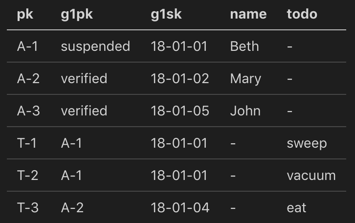
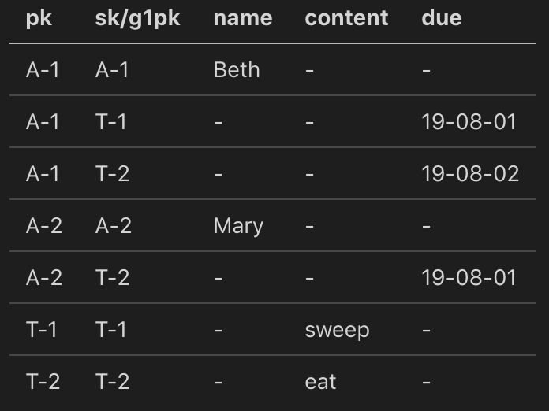

- What is it?
  - AWS's fully-managed, serverless NoSQL database
  - Stored on SSDs across multiple AZs
  - Serverless key-value/document NoSQL database
  - Consistent single-digit ms performance (µs with DAX) at any scale (>20M reqs/sec)
  - Encrypted, steams, instant backup, point-in-time recovery, HA, auto-scaling tables and storage, ACID transaction, pay-per-use, IAM
  - Eventually consistent by default with support for strongly consistent reads
- Why use it?
  - Cursor-based paging eliminates timeouts and duplicate results
  - No performance impact for new columns
  - No need to cluster and/or shard in future
  - Plays nicely with AWS Lambda
- Limitations
  - RDBMS: flexible queries, but expensive, less scale
  - NoSQL: efficient queries in limited number of ways, other queries are expensive, slow
  - Essential to understand access patterns up-front
  - Amazon migrated 90% of their systems to Dynamo, it fits more data models than you realize
  - Cursor-based paging would require either adapter to support limit/offset or new API version
  - No COUNT, must be calculated separately
- Data Modeling Approach
  - Create Entity-Relationship model as usual
  - List all real-time client access patterns
  - Ignore reporting, search, etc., use streams for this
  - If ad-hoc queries are required, stick to SQL
  - Design one table to store your entities with high-cardinality keys, possibly with overloaded indexes and composite sort keys
  - One-To-Many via Composite SK, table can be queried by pk and starts_with, between, >, < etc.
  - Index Overloading
    
    - One table, one GSI
    - Table can be queried by ID for accounts and todo entities
    - GSI can be queried for accounts by status and for todos by account
  - Many-To-Many
    
    - One table, one GSI
    - Table can be queried by ID for accounts and todo entities and for todos per account
    - GSI can be queried for accounts by todo
- Resources
  - [How to switch from RDBMS to DynamoDB in 20 easy steps](https://www.jeremydaly.com/how-to-switch-from-rdbms-to-dynamodb-in-20-easy-steps/), videos linked in article are great
  - [Best Practices](https://docs.aws.amazon.com/amazondynamodb/latest/developerguide/best-practices.html)
  - [NoSQL Workbench](https://docs.aws.amazon.com/amazondynamodb/latest/developerguide/workbench.settingup.html)
  - [DynamoDB Toolbox](https://github.com/jeremydaly/dynamodb-toolbox)
  - Alex DeBrie's [guide](https://www.dynamodbguide.com/) and [book](https://www.dynamodbbook.com/?ck_subscriber_id=512831524#buy)
