It's been over five months since this trip and I haven't finished the blog. But I'm not a quitter.

<figure>
  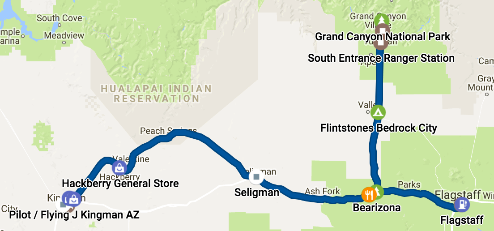
  <figcaption>Flagstaff to Kingman. 372 miles.</figcaption>
</figure>

I wake up in Flagstaff, quickly pack my things, and, before I jump on the bike, I'm met by a guy staring at it. By now, I know this means he has one too and wants to tell me about it. He's having his Harley Road Glide converted to a Big Wheel. When I look clueless, he takes out his phone, does a Google search, and shows me a picture.

<figure>
  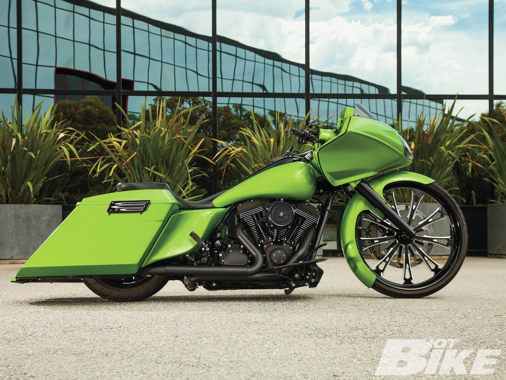
  <figcaption>Big Wheel Harley Road Glide. Source: hotbikeweb.com</figcaption>
</figure>

We flip through a few more before he puts his phone away and wishes me safe travels. [Atlas Obscura](http://www.atlasobscura.com/) is a site that lists off the beaten path attractions and I've been using it throughout the trip. The plan today is to go 60 miles out of my way to see Bedrock City north of Flagstaff because it looks so stupid I have to go. Then, I'll turn around and pick up Route 66 on my way to Kingman, AZ. The ride up Hwy 64 is uneventful and at 9:30 a.m. I pull into the parking lot.

<figure>
  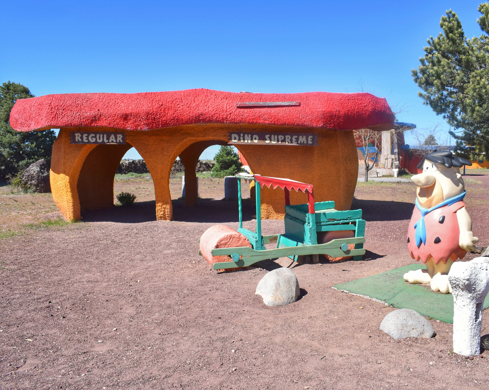
  <figcaption>Bedrock City from The Flintstones</figcaption>
</figure>

There's no line. There's no one at the ticket counter. Am I the only person here? I walk through the gate and a lady comes running over to me. "Did you pay?", she asks, seemingly delighted to speak to another human. I hand over the reasonable \$5 fee and have the place to myself.

<figure>
  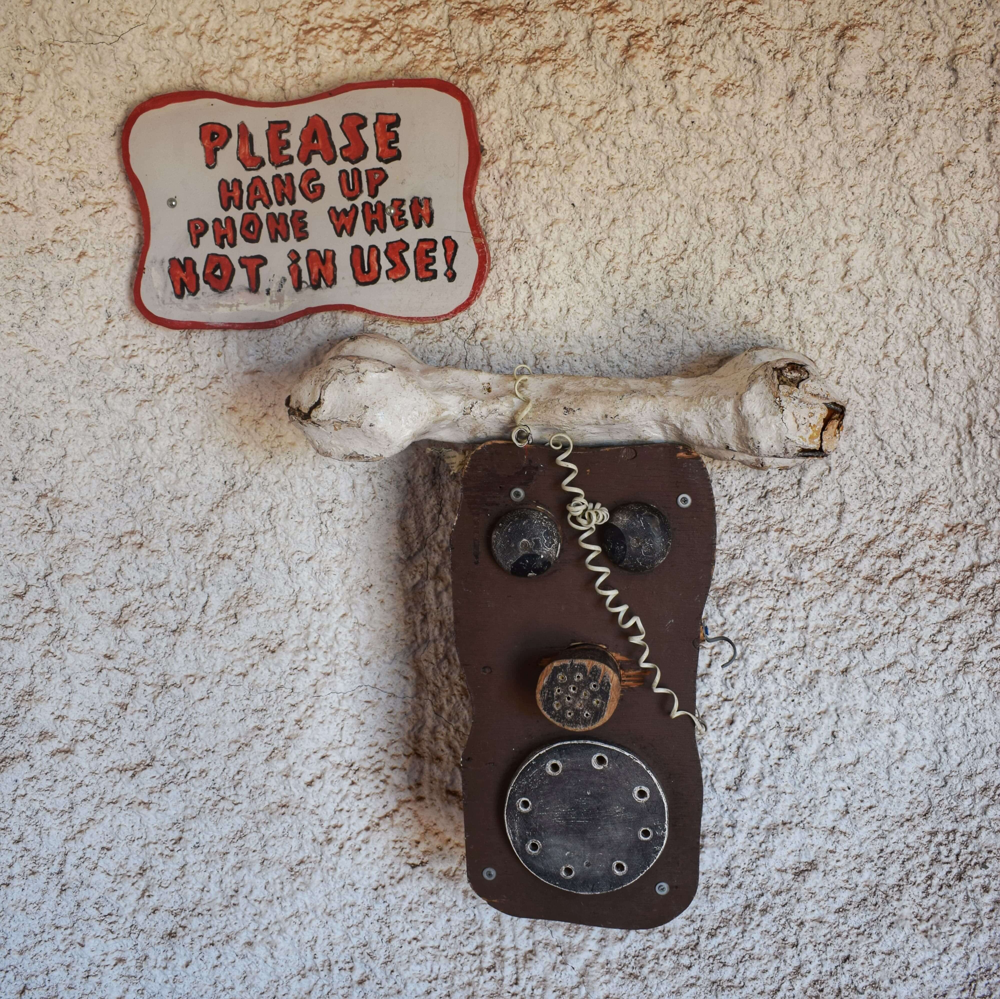
  <figcaption>Late night booty calls on the bone phone</figcaption>
</figure>

Bedrock City is about the size of a football field. Aside from the obvious Flintstone and Rubble houses, there's a post office, police and fire stations, jail, school, and movie theater. I'm not sure even a child would enjoy the place, but I'm laughing simply because of how far I rode to see it.

<figure>
  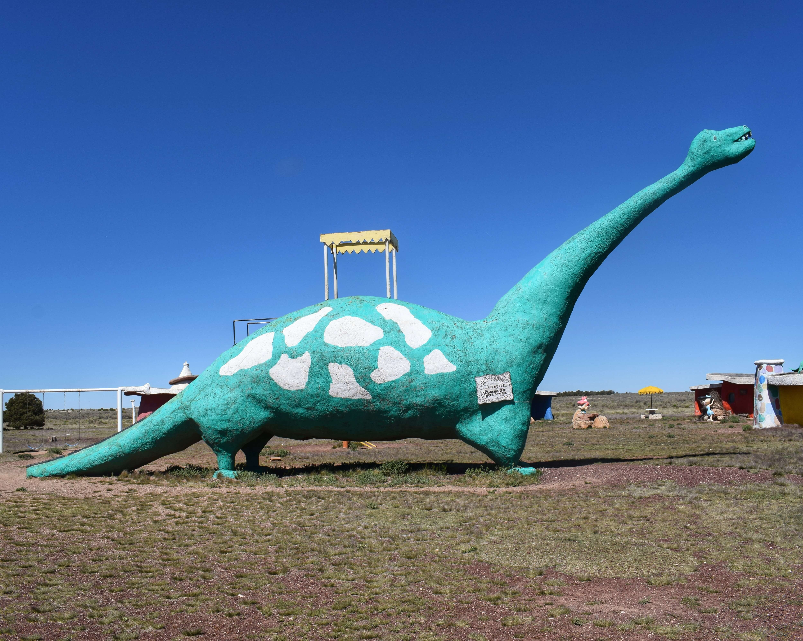
  <figcaption>You best belive I rode down the tail slide</figcaption>
</figure>

I honestly didn't plan to go to the Grand Canyon today since I've already been to the North Rim three years ago. I saw many road signs for it on the way, though, so I pull out my phone to see how far away it is. 28 miles to the South Rim. It is at this point I realize if I'm ever 28 miles from the Grand Canyon, I'm going to the Grand Canyon.

<figure>
  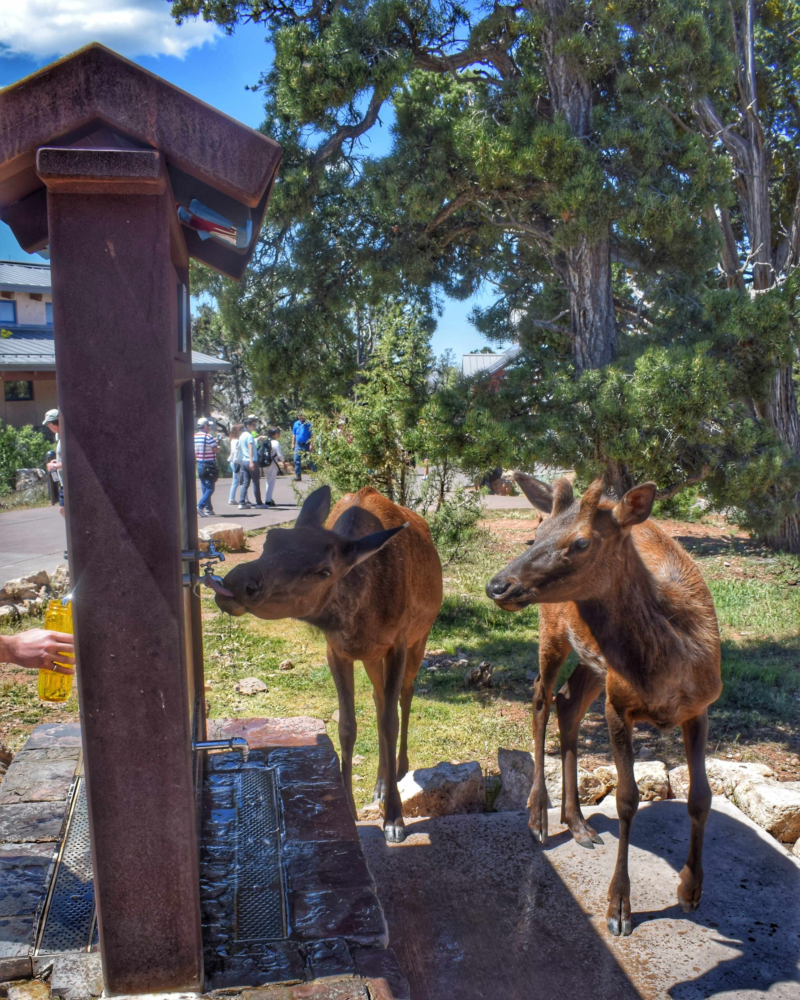
  <figcaption>Wild Elk stealing human water at the Visitor's Center</figcaption>
</figure>

I see another motorcyclist about to leave his make-shift parking spot right in front and pull in next to him. He's a large older man, probably upper 50s. We trade stories and I learn he's also going cross-country. He started in New Jersey and is on his way to the Pacific Coast Highway aka Hwy 1. I immediately light up as it's my favorite road in America. He stops me halfway through my endless recommendations so he can get out a pen and paper to scribble them down. 20 minutes later, he throws a leg over his bike and thanks me for the talk. "It's been me and the guy on the weather radio for the last few days". And on that lonely, depressing note, we shake hands and I head to the South Rim trail.

<figure>
  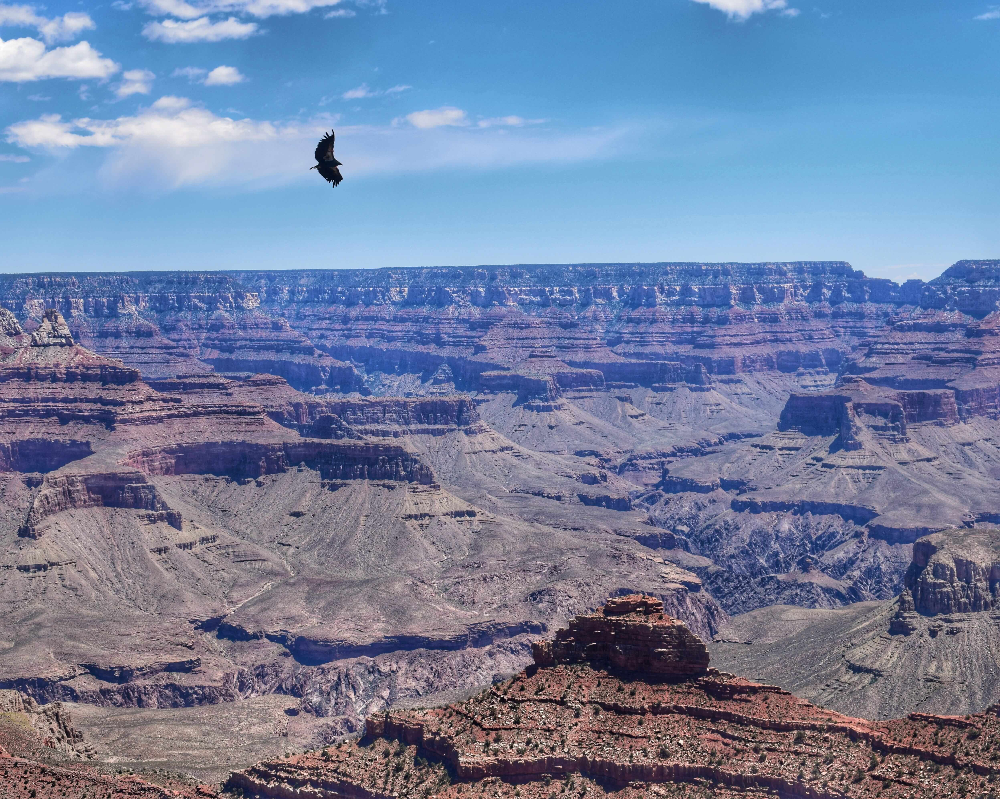
  <figcaption>The Grand Canyon, South Rim</figcaption>
</figure>

I head to an overlook and stare in amazement. Pictures cannot capture its scale, but that doesn't stop me and everyone else from trying. An Eagle drops into the canyon right in front of us and the sound of camera shutters fill the air except for one, "oh my..." from the lady beside me. I take her lead and lower my camera. Noticing I'm no longer glued to it, she whispers in my direction, "this is a once in a lifetime moment". She's right, and we silently follow the Eagle's path through the canyon with our eyes instead of our viewfinders.

It's in this moment that where I am, what I'm doing, and how unlikely it all is comes washing over me. If I'm lucky, I'll fulfill but a few dreams this grand in my lifetime. A dream becomes a reality slowly, with hard work, piece by piece. I've been so caught up in the day-to-day, trying not to die, figuring out where to stay, writing this damn blog, that I've forgotten to step back and appreciate just how "once in a lifetime" all of this is. On the rim of the Grand Canyon in Northern Arizona, I sit down. I slow down. I appreciate it.

<figure>
  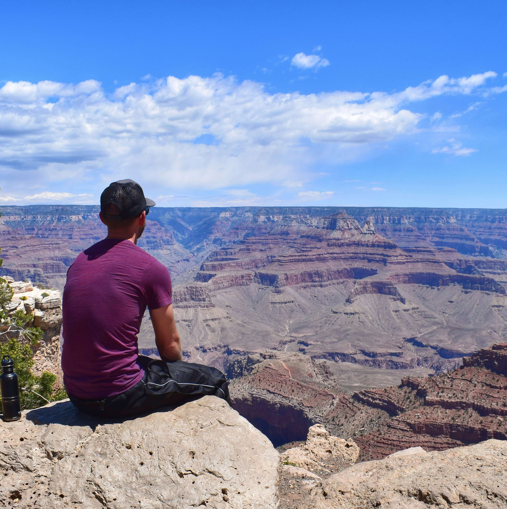
</figure>

> The question is not what you look at, but what you see. ―Henry David Thoreau

Once my moment is over, I ask a real-life person to take my picture. You know, like the old days, before selfie sticks. Last night in Flagstaff, Dan and Kate, the couple I met at the bar, recommended I stop by Bearizona, a drive-through zoo in Williams, AZ. I have a motorcycle, though, and judging by the name, bears will likely make an appearance. Assuming they've worked through this snag before, I risk it.

<figure>
  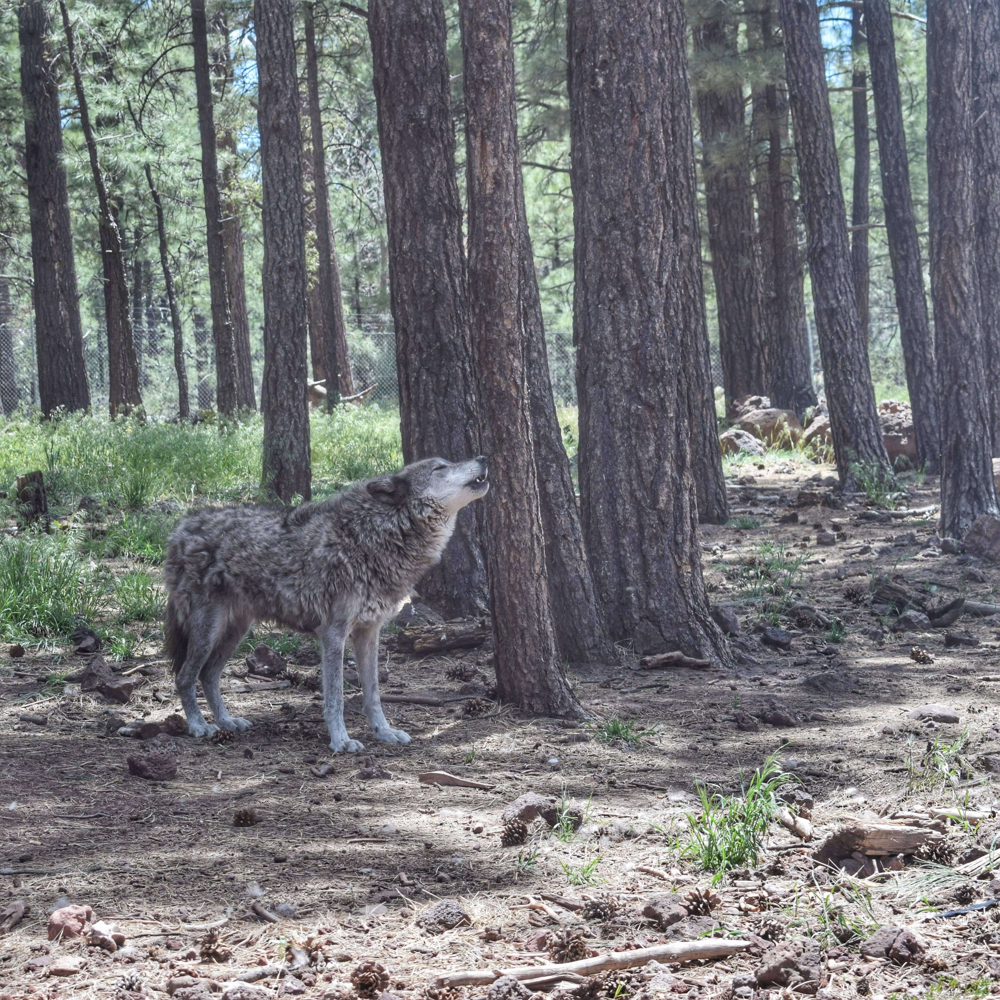
  <figcaption>A fellow lone wolf</figcaption>
</figure>

I backtrack down Hwy 64, pull in, and the lady at the gate assures me if I use one of their rental vehicles I'll escape with my life. I crank the air in the beat-up Ford Taurus and head into the zoo. The animals are roaming free inside large enclosures, each separated by grates you drive over that animals can't figure out. I see bison, deer, elk, wolves, and at the end, the main event—bears.

<figure>
  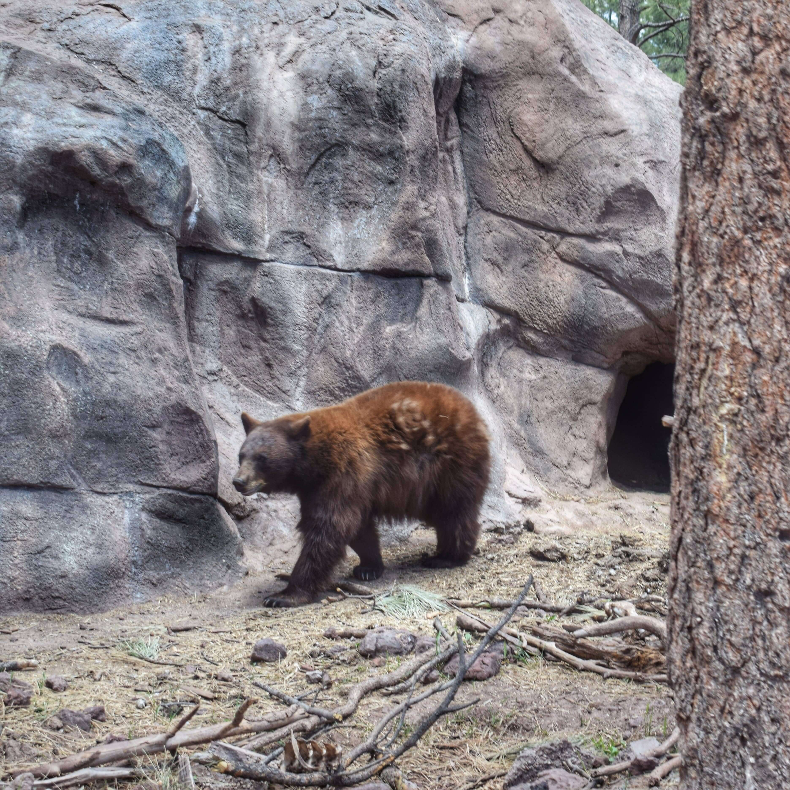
  <figcaption>Bears. At Bearizona.</figcaption>
</figure>

You're not supposed to stop in the bear enclosure. The vehicle in front of me finds out why. A massive black bear jumped on the side of their brand new SUV and started rocking it back and forth. I don't get any cool pictures of it and kind of wish the bear does it to my loaner, but no such luck.

From Bearizona, I head west through Williams for some food, jump on I-40, and exit in Seligman to pick up Historic Route 66, "The Mother Road".

<figure>
  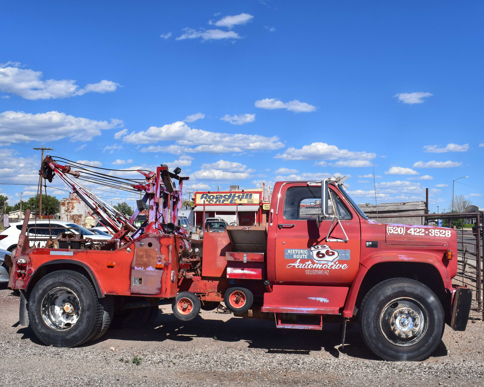
  <figcaption>Roadkill Cafe in Seligman, AZ</figcaption>
</figure>

For the sake of relative brevity, I won't go into detail on its historical significance. But riding it on a motorcycle, matching speed with trains as they barrel alongside the road, and stopping at rundown general stores and gas stations when they catch my eye is quite a feeling.

<figure>
  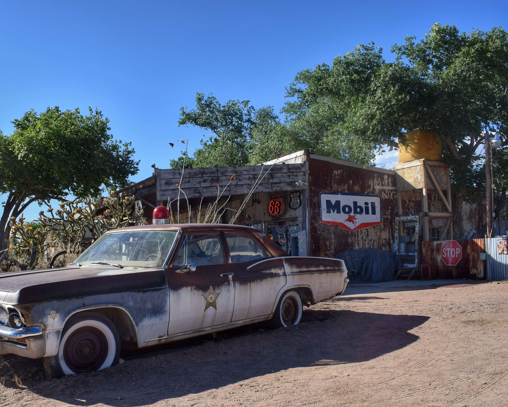
  <figcaption>Route 66</figcaption>
</figure>

With nearly all forms of transportation, the fun begins at the destination. With motorcycles, you don't even need one. It reminds me of turning 16 and getting to drive by myself for the first time. My friends and I would load into the car fighting over the driver's seat and go. It didn't matter where we were going or how long it took to get there, it was all about the thrill of the open road and not knowing exactly where it'd take us.

<figure>
  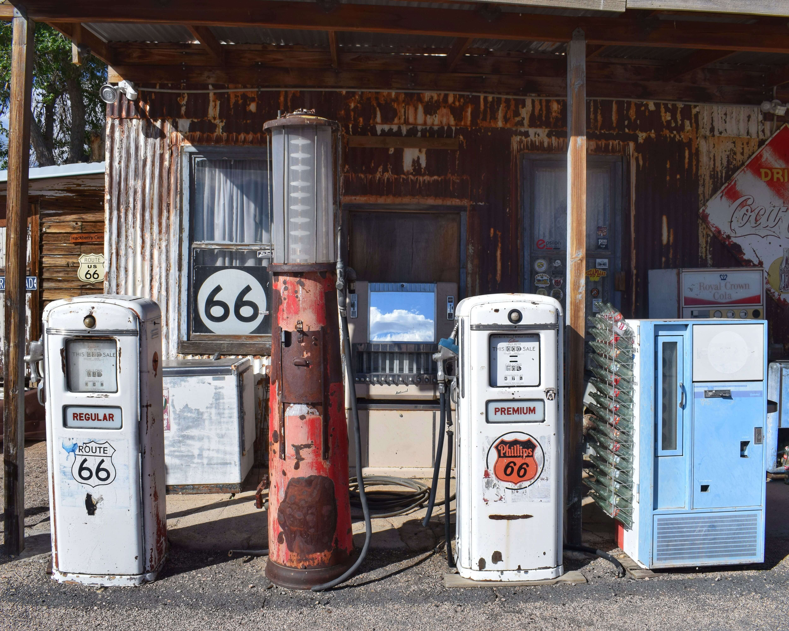
</figure>

I'm usually in my overnight town around by 3 p.m., but with all my stops today, it's already 5 p.m. and I'm 30 miles out. I make one last stop and race the setting sun to Kingman, AZ. I pull into the Ramblin' Rose, unload, and quickly realize I left my phone charger plugged in by the TV at Motel 6 in Flagstaff. Shit. With 10% battery left, I look up the nearest convenience store and take off. I have a newer phone with a USB-C charger, though. He doesn't have anything but sends me to a truck stop up the road. They don't have one either, but they send me to a Walmart 5 miles away. They're on order at Walmart and Staples is closed because it's Sunday. I admit it's sad, but I'm in full panic mode now. I dig around Google Maps and find a Flying J 10 miles away. I buy the last USB-C charger they have with 4% left. My battered phone will survive the night.

<figure>
  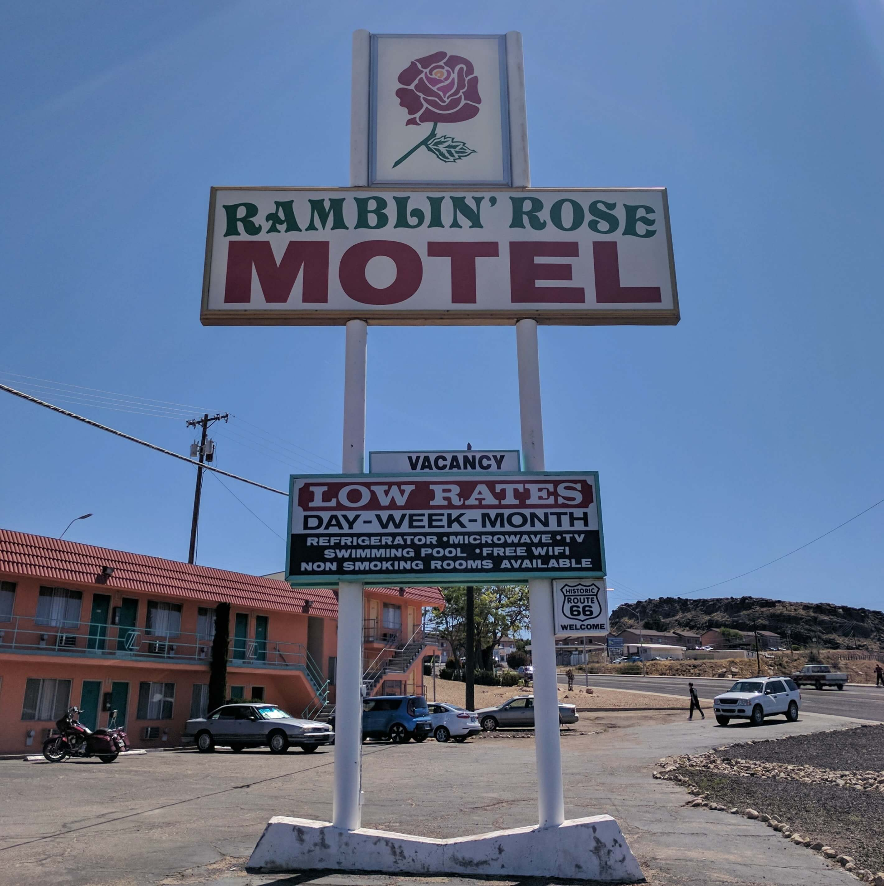
  <figcaption>My glamorous accomodations for the next two nights</figcaption>
</figure>

I head back to my motel, do some writing, eat an entire Domino's pizza and bacon wrapped chicken tenders—regretting it with every bite but not stopping—and get some sleep.

<figure>
  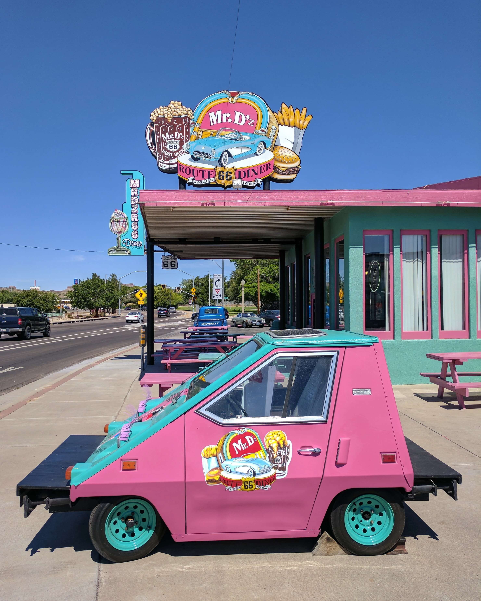
  <figcaption>Mr. D'z Diner</figcaption>
</figure>

The next morning, I decide not to ride up to the Hoover Dam and to instead take it easy and wander around town. I grab breakfast at Mr. D'z and check out the Powerhouse Visitors Center, a cool Route 66 museum. Reading and seeing pictures of how exciting road trips used to be and the lasting memories they gave to children and parents alike makes me a bit sad. With the invention of the Interstate Highway System, we sacrifice joy, adventure, and crazy roadside attractions in favor of lower travel times from point A to point B. Try using the "Avoid Highways" option in Google Maps on your next road trip. It'll take you longer, but who knows what you might discover along the way.

<figure>
  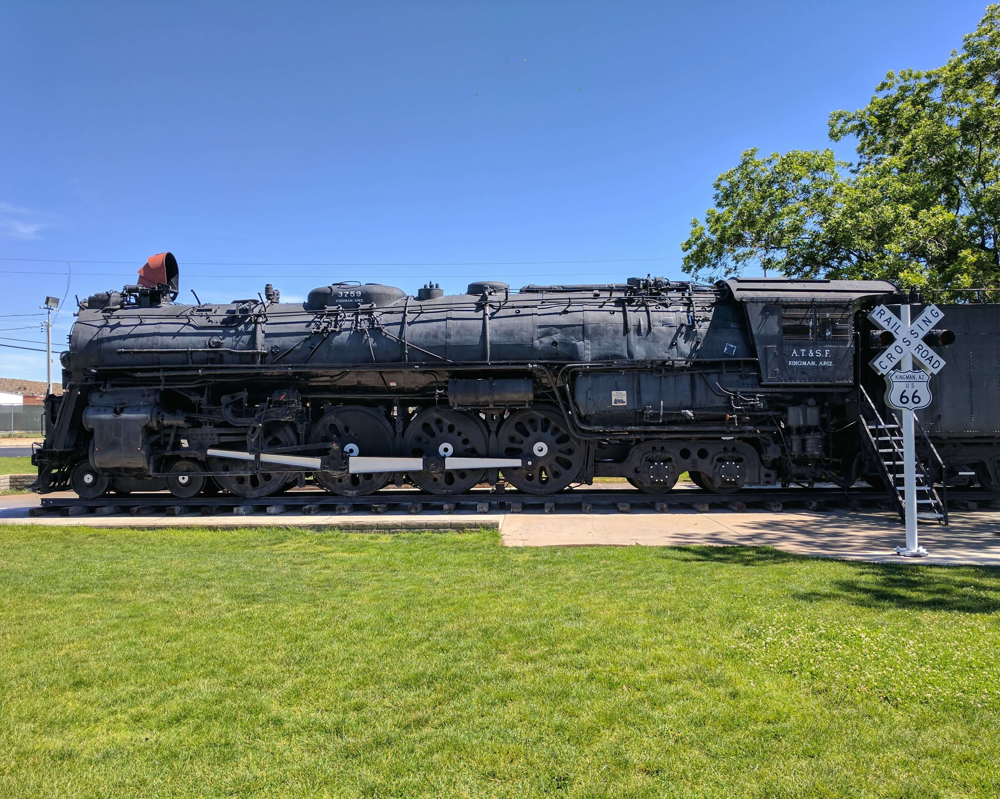
  <figcaption>Massive steam-powered locomotive in Kingman, AZ</figcaption>
</figure>

Tomorrow, I'll enter California, the last state on this coast-to-coast ride! I plan to ride to Joshua Tree National Park and camp before my final push to Los Angeles and the Pacific Ocean. Since I'm writing this blog from the future I can tell you, it doesn't go as planned.
