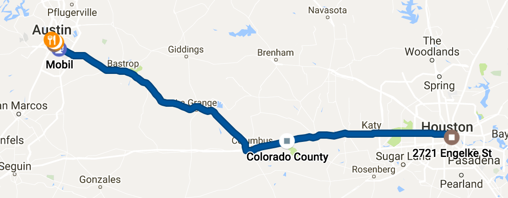
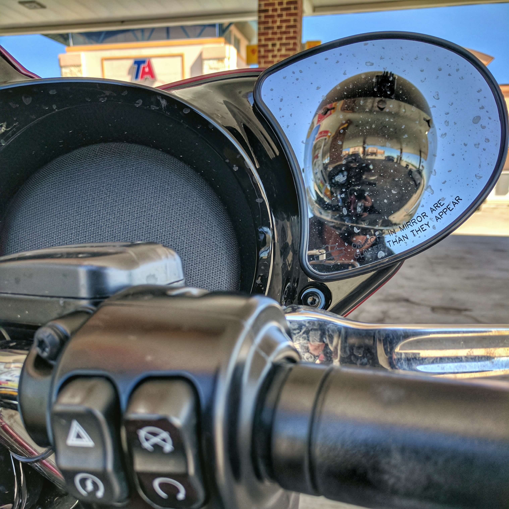
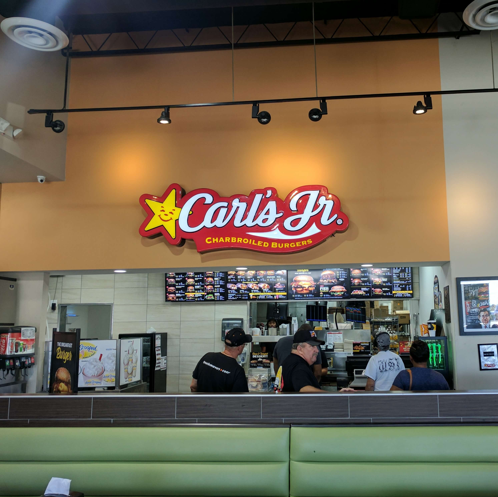
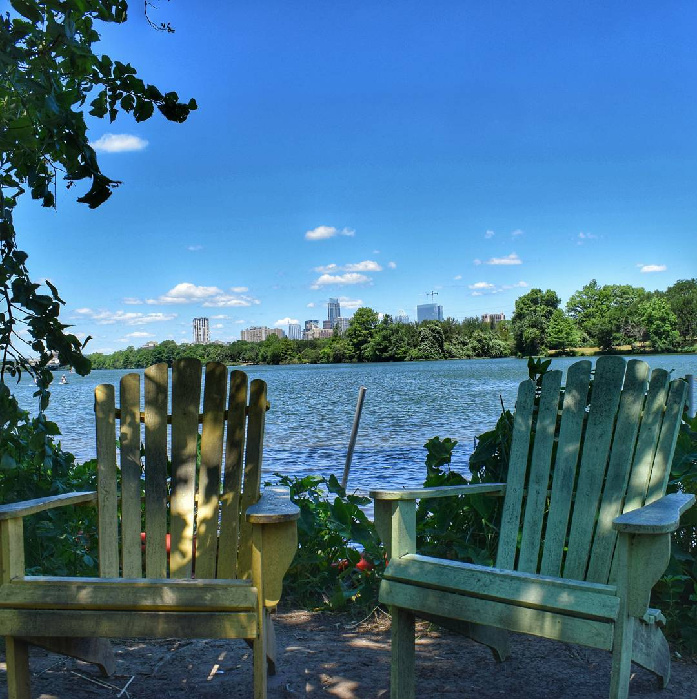
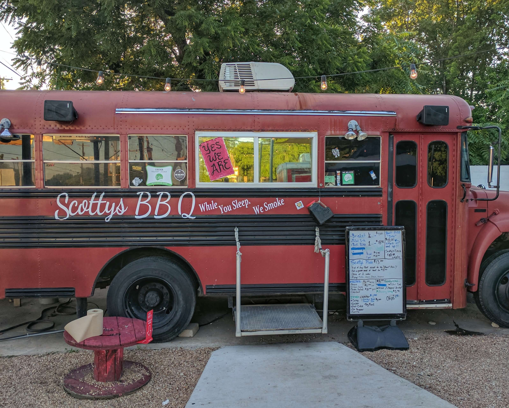
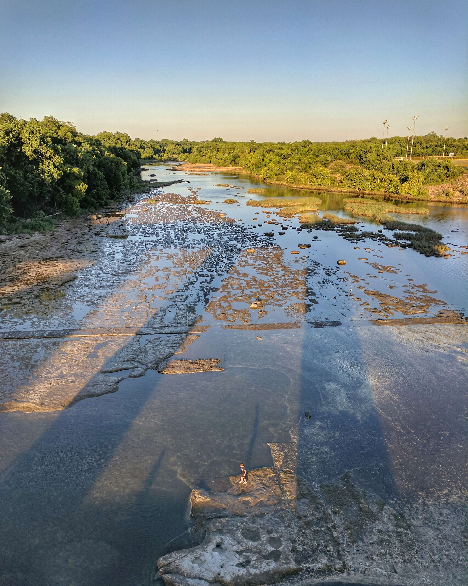
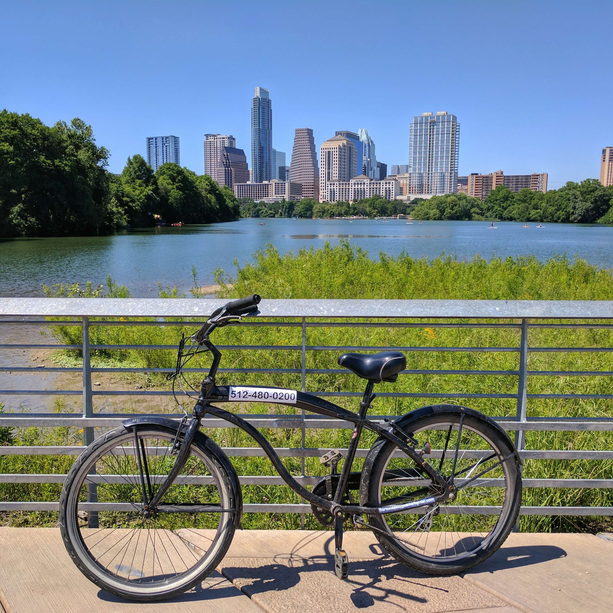
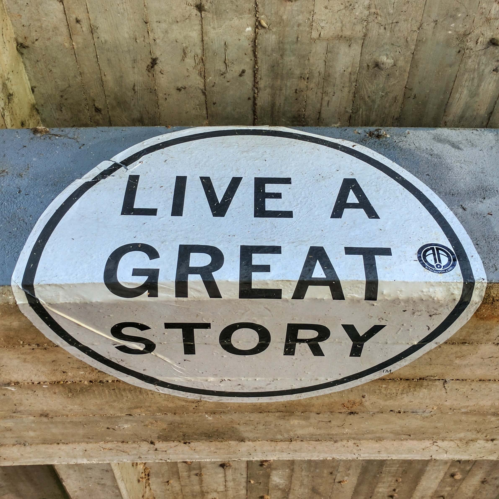
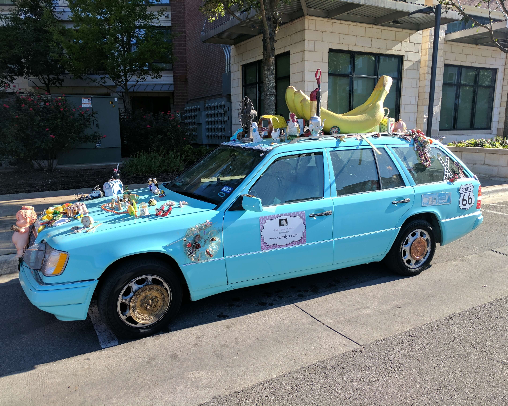
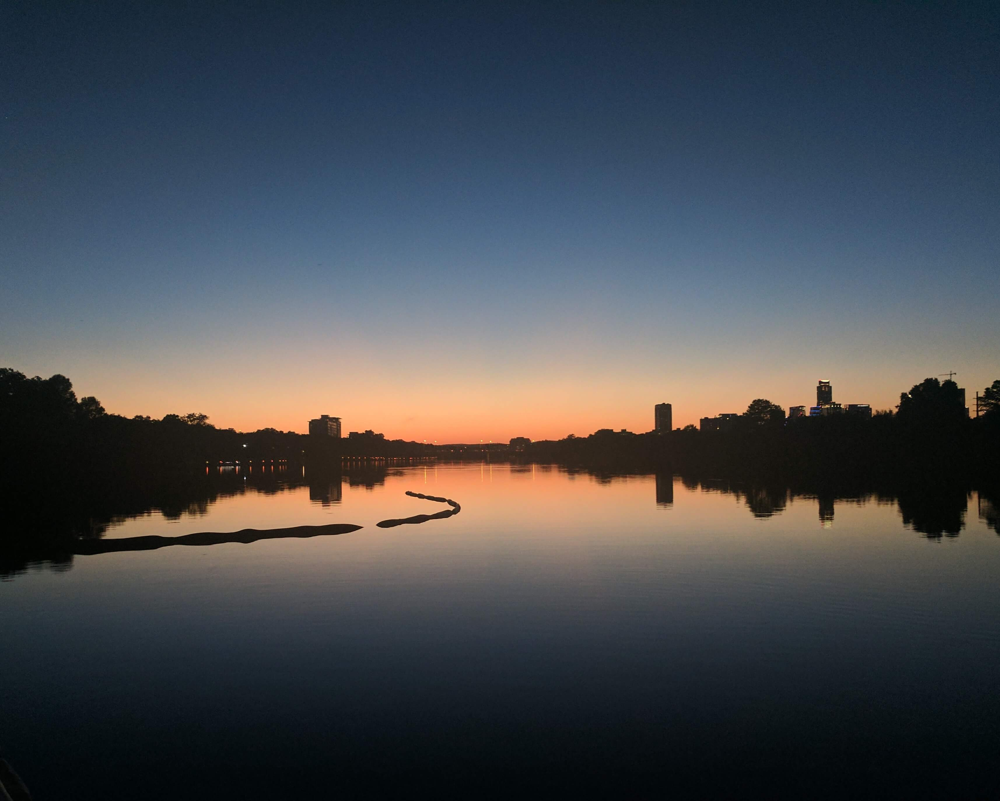

The sixth day starts like the last few, I wake up in a strange room and it takes me a second to remember which town I'm in. This Airbnb has a dorm-style setup as well and there's one other person still sleeping across the room from me. There's only one bathroom and someone from another room is taking a shower so I brush my teeth in the kitchen sink and start the usual packing process. I haven't needed my tent or sleeping bag yet, so they're at the bottom of my dry bag. I throw the clothes I wore last night on top, squeeze the air out, and latch it tight. Everything else goes into the laundry bag. I heft it over my shoulder, grab the dry bag, and bring them outside.

<figure>
  
  <figcaption>Houston to Austin. 163 miles.</figcaption>
</figure>

Everything has it's place on the bike, my attempt to prevent further losses. My backpack and toiletry bag go in the right pannier, the dry bag gets bungeed to the luggage rack, and what remains in the laundry bag goes in the left pannier. I put my camera, water bottle, sunglasses, and hat on top of it for easy access. My phone goes in the chest pocket of my jacket and my ear plugs, motorcycle keys, and wallet…wait a second, where the hell is my wallet? It must be in my jeans, I wore them last night. I open the dry bag and pull them out, nothing in the pockets. Beads of sweat form immediately. I check the shorts I'm wearing under my overpants. I check my overpants. I check my six jacket pockets. I check all of those places again. No wallet. I head back inside, my mind racing, "I don't lose things like this. I used it last night at the bar so it's got to be in the car I took home, inside, or one of my housemates stole it. I can't imagine it's the third. At least I hope not, am I going to have to accuse people I only met 5 mintues ago?" I walk in and my roommate is now sitting up in bed. "You didn't happen to see a wallet laying around, did you?" I ask. "Oh, no", she says sympathetically. I look under my bed, on the top bunk, rip the blanket off the bed, and down to the floor falls my wallet. I threw the blanket off me in the morning because it was hot and it covered up my wallet and the shirt I wore last night. I'm an idiot. But at least I caught it now instead of 100 miles down the freeway when I need gas and can't pay for it. The thought scares me enough to take my debit card out and put it in my backpack to further protect me from myself.

<figure>
  
  <figcaption>Do you have everything, Rocky?</figcaption>
</figure>

Finally on the road after a scare, I merge back onto the dreaded I-10 as rush hour wanes. The traffic is keeping the speeds down until I get further out of town and everyone decides they need to instantly be at their destination. I swear I check my mirrors and no one is behind me, I itch my nose, and there's a car about to rear-end me. The car just appeared. Like a star destroyer exiting light speed. I begin to doubt the driver of this dated Toyota Camry invented interstellar travel and that, instead, I probably need a break. I fuel up and head in to use the bathroom when I get to check off my first goal of the trip, figuring out when Hardee's changes to Carl's Jr.

<figure>
  
  <figcaption>
    Goal: Figure out when Hardee's changes to Carl's Jr. Result: Success.
  </figcaption>
</figure>

I do the next 100 miles in one shot. By the time I exit I-10 for Hwy 71, I'm getting more comfortable with the speed. 71 runs northwest, a welcomed reduction in wind noise since I'm not riding directly into a headwind. I refuel near my hostel and arrive early, around noon. I haven't stayed here before, it sits on the beautiful Lady Bird Lake with the Austin skyline in the distance. I check in, unpack, throw my stuff on my bunk, and wander around. I like hostels when traveling alone. They put you in close proximity to fellow travellers, have hand-picked restaurants, bars, and activities ready for you, and usually have walking tours, bar crawls, or other events you can do with other guests. I have some writing to catch up on today, though, so I sit by the lake and get down to business.

<figure>
  
  <figcaption>Lady Bird Lake</figcaption>
</figure>

I meet a few others in the hostel that are on cross-country trips as well. Mel is Australian but you wouldn't know it talking to her, she doesn't have the accent. She's traveling by herself from Los Angeles to New York and is spending three days in Austin. Later on, a group of ten arrive that are driving from Los Angles to Orlando, my route reversed, but with many different stops along the way. Most people have eaten by the time I'm finished so I make plans to meet them on 6th Street later tonight and walk to Scott's BBQ for brisket. I could eat brisket every day. But I'd die of heart disease.

<figure>
  
  <figcaption>
    Goal: Eat BBQ for every meal in Austin. Result: Failure.
  </figcaption>
</figure>

After dinner and with time to kill, I wander down East Ceasar Chavez Street since I've never been. I head into a number of places and then awkwardly out after their beer selection doesn't suit me. I get one at Craftsman and sit on the patio, but it's now dinner on Friday night and I'm staring at people as they walk by. Not a good look. I drink a little faster than usual and move on. I cut up to East 6th, the less clubby area with an older crowd, and eventually to "Dirty 6th". School is out so it's not as busy as I remember it. The large group from the hostel goes to a dance club. My clubbing days are behind me, though, so I follow a few others to a quieter place next door. After a few drinks and stories of our travels, we head back to the hostel and call it an early night.

<figure>
  
  <figcaption>
    Little kid about to piss his dad off by jumping in the river.
  </figcaption>
</figure>

I sleep in longer than I planned and all the people I was with last night are already out being productive. I consider staying another night. The location is peaceful and I haven't stayed in a city more than one night thus far, I could use the break from riding. I book for another and spend the remainder of the morning and into the afternoon booking rooms for the next few days and using [Atlas Obscura](http://www.atlasobscura.com/) to look up things to do along my routes. It's the first time I've looked at them since I planned them three weeks ago and I'm pumped.

At around 2 p.m. I'm hungry. I rent a bike from the hostel and break my vow of only BBQ to get a burrito. For a while there in San Francisco I averaged a burrito per week. Mission Burritos are famous for good reason, they're delicious. Austin's couldn't quite stack up. But I got free chips and salsa, a serious, life threatening addiction of mine, so I'm happy. Jumping back on the hottest bike in Austin, it was time to explore.

<figure>
  
  <figcaption>Cruising Austin's Greenbelts on this babe magnet</figcaption>
</figure>

There's a beautiful, tree-lined trail along the Colorado River. I take it northwest for a few miles and then cut up Barton Creek, a kayak and paddleboarding hotspot on this perfect Saturday, to the Barton Springs Swimming Pool. I pass the Zilker Zephyr Minature Train on the way, a bunch of kids are riding it. I pull out my phone, take a bad picture, and as I'm putting it back in my pocket a little girl rides by resting her chin on her hand with a giant frown. She's having the worst time of anyone that's ever ridden a delightful minature train. I whip my phone back out but can't get the picture snapped in time. It would have been blurry anyways, I was laughing pretty hard. The pool sure looks nice, but I didn't bring my swim gear so I continue on the trail. The trees become less frequent and the trail turns rocky just west of the pool. The heat and shitty trail aren't appealing on my "day off" so I do a U-turn and head back the way I came, spotting this sticker under an overpass.

<figure>
  
</figure>

I realize I'm close to Rainey, a cool neighborhood where most of the bars are in converted houses, so I head there to catch the Cubs game. After walking the length of the street, the only bar that has it on also has a loud ass DJ and no where to sit. I must be getting old, because I leave immediately. Instead, I go to Craft Pride for a local IPA. I sip it and relax on the patio where I decide to head back to the hostel and write a bit more. On the bike ride back, I stumble upon this upsetting car.

<figure>
  
  <figcaption>¯\_(ツ)_/¯</figcaption>
</figure>

A few of the people from last night are at the hostel so we have a few beers on the patio and catch the sunset. I finish my writing around 11 p.m. and head to bed, I have a big day tomorrow riding through Texas Hill Country!

<figure>
  
  <figcaption>Sunset over the Colorado River</figcaption>
</figure>
