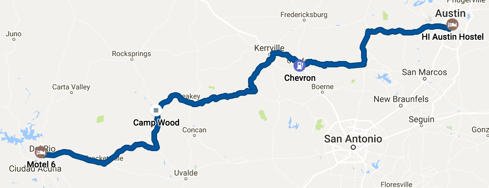

I wake up after my second night in Austin ready to go. A month back, I bought Butler Motorcycle Maps for most states I'm passing through and today is the first I'll get to use. Texas Hill Country starts west of Austin and north of San Antonio and stretches west to Del Rio, TX on the Mexican border. Butler Maps highlight the best motorcycle rides and rate them from G1, the best, to G3, still great. On the zig-zagging ride, I put together, I'll ride six G1 stretches, fourteen G2s, and ten G3s. That doesn't mean much to most reading this, but it's insane. For perspective, the three days I'm riding New Mexico, I'll ride only see two G1s, seven G2s, and three G3s.

<figure>
  
  <figcaption>xxx</figcaption>
</figure>

<figure class="centered">
  

    

      

        
      

      

        <figcaption class="caption">
          Austin to Del Rio. 271 miles, markers 17-21 on the{" "}
          <a target="_blank" href="https://www.rockywarren.com/posts/">
            map
          </a>
          .
        </figcaption>
      

    

  

</figure>

After checking out and loading up, I head west on Hwy 290. It's early, 8 a.m. on a Sunday, and I'm joined by other riders with similar plans as we turn south to pick up Hwy 281 into Blanco, TX. The speeds are still 75 mph in parts, but with less traffic brings fewer tasks for my mind to juggle. The hills are growing more frequent and I see my first armadillo as I fly by its carcass on the side of the road. A living armadillo still eludes me.

South of Blanco, I turn west on Farm To Market 473, a beautifully curving road passing through small towns on its way to Comfort, TX. Heading out of town, I decide to turn around and fill up before heading up the small Old Cypress Creek Road to Kerrville. I pull over to get directions to the nearest gas station and when I try to start the bike back up, nothing. I check the ignition switch, the kill switch, and grip harder on the clutch before trying again. Nothing. I put the kick stand down and turn everything off. I've been riding for 100 miles, I'm missing something obvious. I turn the ignition back on, kickstand up, clutch in, start you piece of shit! Not a peep. Now I start to panic a bit. I'm in a residential part of town so it's not like I can't get help. But if there's something wrong with the bike, my trip could be over. Maybe it's a connection issue since it's not even attempting to start. The starter is on a rocker with the hazard lights. So I turn the hazard lights on and off, do the 'ol jiggle trick to the ignition, and try one last time. And mysteriously, it starts. Well, that was weird. Guess I'll get gas and pretend it didn't happen.

<figure>
  
  <figcaption>xxx</figcaption>
</figure>

<figure class="centered">
  

    

      

        
      

      

        <figcaption class="caption">Highway to Hell</figcaption>
      

    

  

</figure>

I have no issues getting it started at the gas station so everything must be perfectly back to normal. Old Cypress Creek Road is narrow with no center line as it winds along the creek through the woods. I don't listen to much country music anymore, but in honor of my favorite artist growing up, George Strait, I dedicate the rest of Texas to his greatest hits. It's a beautiful, slow ride that, with George on the radio, brings back memories of 4-wheeling through the Wapsi Woods as a kid. Minus the mosquitos the size of Volkswagons swarming even the smallest patch of exposed skin to get their fill. Pretty remote now, I want a picture and instinctively shut the bike off and grab my camera.

<figure>
  
  <figcaption>xxx</figcaption>
</figure>

<figure class="centered">
  

    

      

        
      

      

        <figcaption class="caption">
          Over the river and through the woods
        </figcaption>
      

    

  

</figure>

When I try to start it again, I'm back to nothing. I've passed a few cars so I'm still holding it together. I perform my patented hazard lights toggle, ignition switch jiggle trick and it fires right up. If this software thing doesn't work out, my résumé is looking pretty good for Harley mechanic. I elect to not turn the bike off in the middle of nowhere until I figure out what's going on.

The G1 stretch of the road into Kerrville is constant rolling hills. You know that weightless feeling you get as you reach the peak of a hill in a car and start down the other side? It's that. Over and over again. Like a roller coaster. I could do this stretch all day and night but am anxious to see what lies ahead and plow on with a smile.

Recharged from the thrill of the ride and knowing what's coming next, I bypass Kerrville and take the winding Hwy 16 to Medina. I pick up Farm to Market 337 heading west, considered by many to be the best motorcycle road in the country. FM335, 336, and 337 comprise The Three Sisters aka The Twisted Sisters motorcycle loop.

<figure>
  
  <figcaption>xxx</figcaption>
</figure>

<figure class="centered">
  

    

      

        
      

      

        <figcaption class="caption">
          Butler Map of Texas Hill Country. See all those bright yellow G1s?
          They form The Twisted Sisters loop
        </figcaption>
      

    

  

</figure>

Just before hitting the first G1 east of Vanderpool, a sign reads "11 Riders have died since…". I don't see the whole thing because a turn is coming and I don't want to be the twelfth. The sign has it's desired effect. I slow down and take in the sites instead of trying to break speed records on a half ton bike.

I remember a few months into owning a motorcycle I was riding Redwood Road east of Oakland, CA. It winds along and then down a mountainside through a regional park with trees in every direction. The shade is cool, the forest scent pleasant, and it's hard not to get lost in the beauty of it all. Without thinking, I said aloud to myself under my facemask, "this is it" as if I'd found something. I suppose I had. Motoring down the twisting FM337 is pure joy. Many other riders are heading the other direction or stopped along the road for breaks and I exchange waves with each of them. This ritual struck me when I started riding too. No matter what bike you ride, how you're dressed, or where you are, when you pass another rider, you wave. And immediately feel like you're part of something bigger. A connection, however fleeting, with someone else that's found the same thing.

> What you seek is seeking you. ―Rumi

The ride, the beauty, the twisties continue through Vanderpool and Leakey. Over the final hill and down into Camp Wood, I spot my first vile deer of the trip, but surely not my last. They're dangerous enough in a car and deadly on a motorcycle. I slow immediately and creep past them as they stare dumbly from both sides of the road. It's been 100 miles since my last stop, so I pull in to fill up, happy with how early I spotted the deer and my reaction once I did. "Bikers Welcome" signs abound, I hear the cashier explaining The Twisted Sisters route to a couple geared out in Indian Motorcycle clothing. I hit the bathroom and take some swigs of water. I've ridden one of the greatest roads in the world. And while I still have a soft spot for Hwy 1 north of San Francisco and south through Big Sur, it didn't disappoint.

<figure>
  
  <figcaption>xxx</figcaption>
</figure>

<figure class="centered">
  

    

      

        <video controls>
          <source src="../../assets/twisted-sisters.mov" type="video/mp4">
          Your browser does not support the video tag.
        </video>
      

      

        <figcaption class="caption">Riding The Twisted Sisters, considered the greatest motorcycle loop in the country.</figcaption>
      

    

  

</figure>

From Camp Wood, it's a quick 80 miles though still beautiful but straighter roads into Del Rio. My body is holding up great so far, but on this final stretch, my right knee starts to ache. The Harley has crash bars on the front so if you go down, the weight of the bike doesn't land on your leg. I stretch my leg straight out and rest it on top, a move just yesterday I was too scared to do. My confidence on this beast is improving. I also haven't had issues starting it since Cyprus Creek Road.

Del Rio is a border town of 40,000 and is home to Laughlin Airforce Base, it's number one employer. The U.S. Border Patrol is the number two employer. From Orlando to Austin, I've only seen a handful of cops. From Kerrville to Del Rio, between border patrol and police, I see maybe 15. I swing in to fill up on gas and head to Motel 6, nothing but the best accommodations.

<figure>
  
  <figcaption>xxx</figcaption>
</figure>

<figure class="centered">
  

    

      

        
      

      

        <figcaption class="caption">
          I spend a lot of time at gas stations
        </figcaption>
      

    

  

</figure>

It's 1:30 p.m. and there's a Whataburger next door to my motel. "Dreams do come true", I think. I've only had it once before, at 2 a.m. after a night out in Austin, and remember how delicious it was. I shower and head over, only to be completely disappointed with my meal. It seems 2 a.m. after many beers is the only acceptable time to eat here. There aren't any interesting places nearby and I'm mentally tired from the ride. So I grab a 6-pack of Goose Island IPA, strangely all over around here, and head back to my comfortably chilled room.

It's Mother's Day, so I call my dearest mother and let her know I might be without cell service tomorrow as I head to Big Bend National Park. I get some writing done and watch the first TV of the trip for a half hour before going to sleep. After a ride like today and hearing about west Texas from others, I imagine a bland morning until I hit Big Bend. Little do I know it will be my favorite ride so far.
