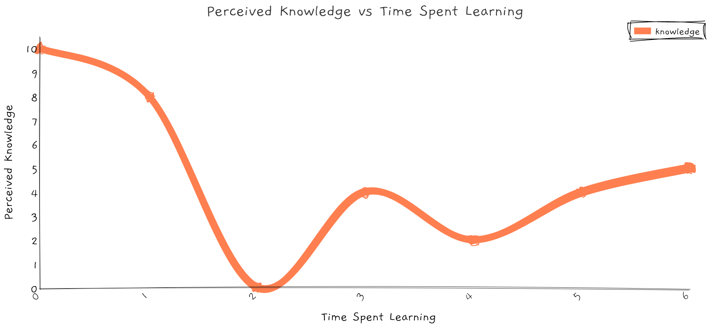

I've historically been skeptical of certifications. I prefer hands-on experience, books, and articles over what I perceived as a fancy line item on a resume. With time on my side during the pandemic, however, I started studying for the AWS Solutions Architect - Assocate certification to see where it led.

Where it led was a 30-hour rabbit hole of videos, playing around in the AWS console, and taking practice exams exposing just how few details I knew. Knowing what EC2 does is different than knowing when you'd select each of the available EBS volumes and the steps required to encrypt an existing volume. Knowing when to use and what belongs in a VPC is different than knowing how to configure subnets, internet gatways, NACLs, routing tables, and NAT gateways.

When architecting systems and developing software, knowing which tools and techniques are at your disposal gives you a major leg up. You can't take advantage of something you don't know exists.

> "Chance favors the prepared mind." ―Louis Pasteur

With constant releases, however, it can seem like a full-time job just keeping up. AWS, as one example, has over 160 regularly updated services with no slowdown in sight. Though you'll never keep up with everything, certifications are a useful way of learning those things AWS deems valuable.

## Benefits

- Life is broken, fix it, now life isn't broken
- Aws orgs (paying only, no resources), acloudguru
- Learned stuff!
- Resume
- IQ
- APN
